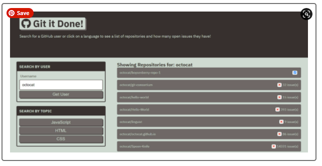

# git-it-done
Module 6: Server-side APIs

## Purpose
Amiko is working on a web app that uses GitHub's API to search for open source projects with open issues and pull requests. Most of the HTML and CSS for this project is done, but Amiko needs me to add the JavaScript that will retrieve and display repositories and their open issue counts when a user searches for them.

## Built With
* JSON Formatter
* GitHub API
* Git Hub

## Contribution
Made with ❤️ by Samantha Malone
Shout out to my tutor
© 2021 Samantha Malone. All rights reserved.
